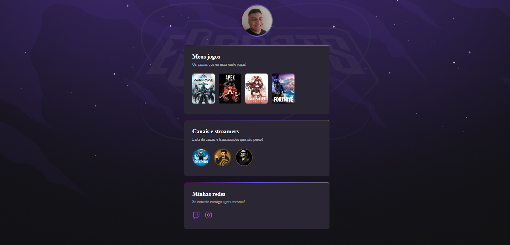

# NLW eSports 

> Trilha Explorer

Projeto constuido do evento Next Level Week da Rocketseat mostrando alguns jogos que eu jogo e streamers que eu acompanho e esse é um dos meus primeiros projetos que está sendo colocado no meu Github espero que gostem  😉.

[ 🔗 Clique aqui agora para acessar](https://mrsulyvahn.github.io/eSports/)

## 🔨 Tecnologias

- HTML
- CSS
- Git e Github

##  📖 O que eu aprendi

Aprendi com HTML e CSS a como criar uma página e nela conter imagens, links, bordas, animação e muitas tags. O aprendizado nesse evento foi muito bom e será aplicado em projetos futuros! 

##  ✉️ Contato

joaovnerydurval@hotmail.com
